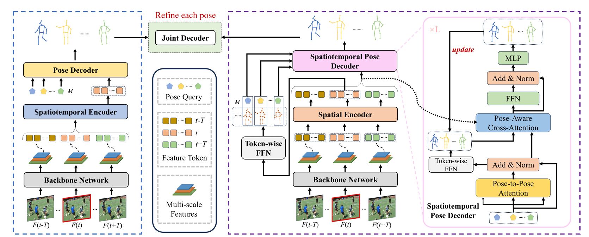
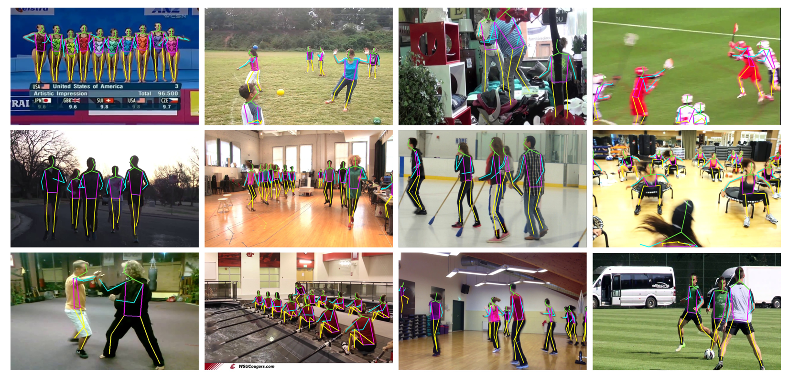
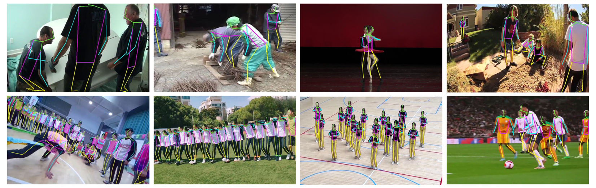

# End-to-End Multi-Person Pose Estimation with Pose-Aware Video Transformer

This repo is the official implementation for **End-to-End Multi-Person Pose Estimation with Pose-Aware Video Transformer**[arxiv](https://arxiv.org/abs/2511.13208). The paper has been accepted to [AAAI 2026](https://aaai.org/conference/aaai/aaai-26/).


## Introduction

Existing multi-person video pose estimation methods usually follow a two-stage pipeline, first detecting human instances in each frame and then applying temporal models for single-person pose estimation. This approach involves multiple heuristic operations, including human tracking, RoI cropping, and non-maximum suppression (NMS), limiting the overall efficiency and accuracy.In this paper, we present PAVE-Net, the first fully end-to-end framework for multi-person pose estimation in videos, effectively eliminating these heuristic operations. A core challenge for our approach is accurately associating individuals across frames, given multiple independently yet overlapping temporal trajectories.To address this, we propose a novel Pose-Aware Video Transformer Network (PAVE-Net). Specifically, our method first employs a spatial encoder to model local dependencies among detected objects within individual frames. Then, a spatiotemporal pose decoder captures global dependencies between pose queries and feature tokens across multiple frames.
To ensure accurate temporal association, we introduce a pose-aware attention mechanism, enabling each pose query to precisely aggregate features corresponding exclusively to the same individual throughout the video. Additionally, we explicitly model spatiotemporal dependencies among keypoints of each pose, further improving estimation accuracy.
Extensive experiments on video pose estimation benchmarks demonstrate that our PAVE-Net not only significantly surpasses previous end-to-end image-based methods, but also competes favorably with state-of-the-art two-stage video-based approaches in terms of both accuracy and efficiency.



## Weights Download
The model weights will be uploaded soon. Please stay tuned.

## Visualizations
Here are some qualitative results from both the PoseTrack dataset and real-world scenarios:



## Usage and Install 
To download some auxiliary materials, please refer to [DCPose](https://github.com/Pose-Group/DCPose).

Follow the [PETR](https://github.com/hikvision-research/opera) to install the mmcv and mmdetection.
### Training
```
python tools/train.py --cfg your_config.yaml
```
### Evaluation
```
python tools/test.py --cfg your_config.yaml
```
### Citations
If you find our paper useful in your research, please consider citing:
```
@article{yu2025end,
  title={End-to-End Multi-Person Pose Estimation with Pose-Aware Video Transformer},
  author={Yu, Yonghui and Cai, Jiahang and Wang, Xun and Yang, Wenwu},
  journal={arXiv preprint arXiv:2511.13208},
  year={2025}
}
```

## Acknowledgment
Our codes are mainly based on [PETR](https://github.com/hikvision-research/opera). Part of our code is borrowed from [DCPose](https://github.com/Pose-Group/DCPose) and [RLE](https://github.com/jeffffffli/res-loglikelihood-regression). Many thanks to the authors!
